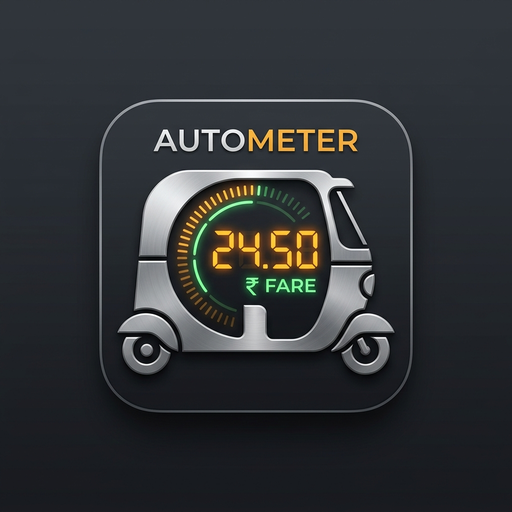
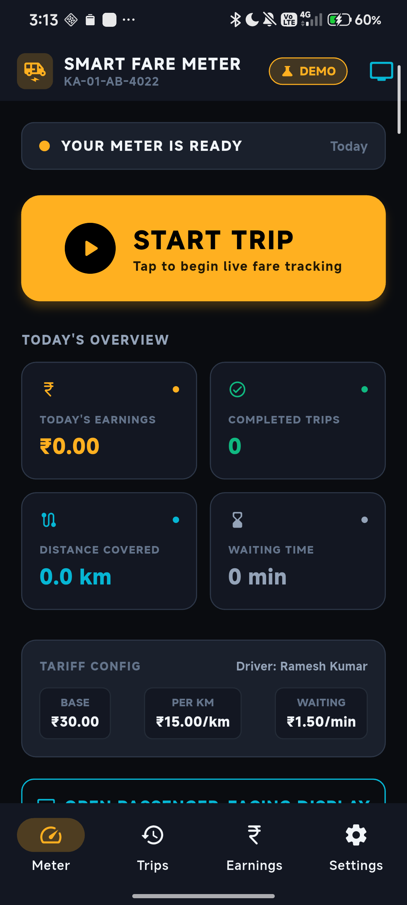
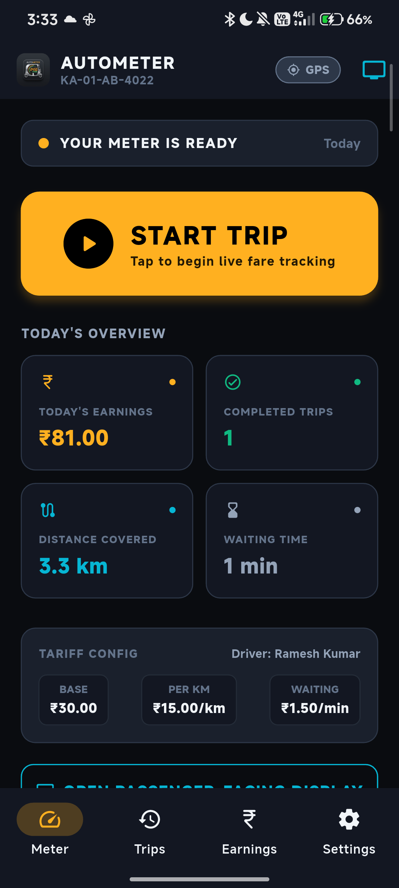
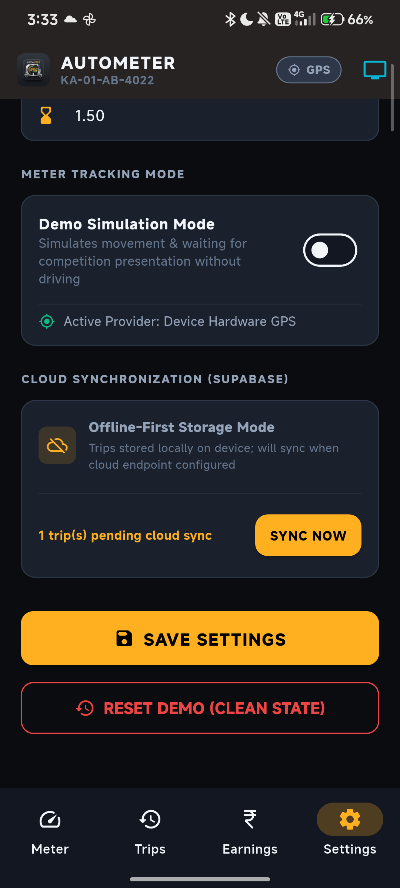
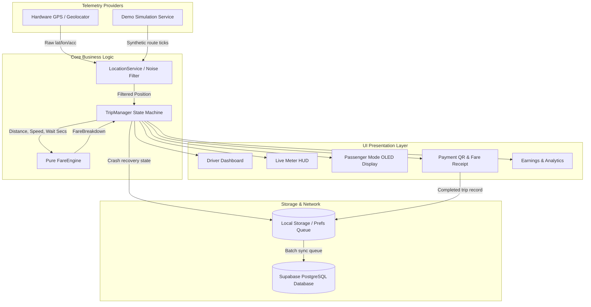

<div align="center">



# 🛺 AutoMeter
### Next-Gen Smart Fare Meter with Dynamic UPI Payment for Auto-Rickshaws

[](https://github.com/jvstin47/AutoMeter/releases/latest)
[](https://github.com/jvstin47/AutoMeter/releases/latest/download/AutoMeter-v1.0.0.apk)
[](https://flutter.dev)
[](https://github.com/jvstin47/AutoMeter/actions)
[](LICENSE)

*An Android-first digital proof-of-concept and firmware testbed for India's 3-wheeler auto-rickshaw ecosystem — combining real-time GPS telemetry, zero-auth driver workflow, passenger OLED HUD, and dynamic NPCI UPI QR code generation.*

</div>

---

## 📱 Download & Test the App (APK)

You can download the ready-to-install Android APK directly and test it on any Android phone (Android 8.0+):

| Asset | Version | Direct Download Link | Description |
| :--- | :---: | :--- | :--- |
| 📦 **AutoMeter APK** | `v1.0.0` | [**Download AutoMeter-v1.0.0.apk**](https://github.com/jvstin47/AutoMeter/releases/latest/download/AutoMeter-v1.0.0.apk) | Standalone release build for physical testing |
| 🏷️ **All Releases** | Any | [**Browse All Versions**](https://github.com/jvstin47/AutoMeter/releases) | Incremented version history (`AutoMeter-vX.Y.Z.apk`) |

> 💡 **Installation Tip**: If downloading via phone browser, tap the downloaded `.apk` and allow *"Install from unknown sources"* if prompted by Android.

---

## 📸 Screenshots Showcase

<div align="center">

| 1. Driver Dashboard | 2. Live Meter HUD |
|:---:|:---:|
|  |  |
| *"Your Meter is Ready" — Zero-Auth Instant Boot* | *Real-time fare, distance, & waiting timer* |

| 3. Passenger Display | 4. Settings & Simulation Control |
|:---:|:---:|
|  |  |
| *Ultra-high-contrast 92pt OLED display* | *Demo simulation controls & Supabase cloud sync* |

</div>

---

## 🌟 Key Highlights & Engineering Features

### 1. ⚡ Zero-Authentication Driver Workflow
* **Instant Boot**: No login, passwords, OTPs, or fleet registration.
* Opening the app boots directly to **"YOUR METER IS READY"**.
* Designed specifically for physical device mounting on an auto-rickshaw dashboard.

### 2. 🧮 Pure, Deterministic Fare Engine
* **Clean Architecture**: `FareEngine` is a 100% pure Dart class, decoupled from the Flutter UI and native OS. Ready to be ported to embedded C++/MicroPython on ESP32 or Raspberry Pi.
* **Standard Tariff Calculation**:
  $$\text{Fare} = \text{BaseFare} + \max(0, \text{Distance} - \text{MinDistanceKm}) \times \text{RatePerKm} + \text{WaitingMinutes} \times \text{WaitingRatePerMin}$$
* **GPS Noise & Anomaly Filtering**:
  * Haversine distance with spherical Earth radius ($6,371\text{ km}$).
  * Velocity jump rejection ($>90\text{ km/h}$ discarded).
  * Weak accuracy discard threshold ($>35\text{ m}$ filtered).
  * Auto-stationary detector ($<4\text{ km/h}$ triggers waiting time accumulation).

### 3. 💳 Dynamic NPCI UPI QR Code Generation
* Eliminates driver/passenger keypad friction and wrong-amount manual transfers.
* Automatically constructs compliant NPCI UPI Deep Links:
  ```text
  upi://pay?pa=<driver_upi_id>&pn=<driver_name>&am=<exact_amount>&cu=INR&tn=Auto%20Trip%20#TRP-XXXX
  ```
* Renders real-time vector QR code via `qr_flutter` on trip completion.
* Provides dual settlement confirmation: **"Mark as Paid (UPI)"** or **"Cash Paid"**.

### 4. 🪟 High-Visibility Passenger Mode
* Dedicated toggle for passengers sitting in the rear.
* 92pt high-contrast digital amber typography against pure OLED black (`#000000`).
* Safe exit handling (`PopScope`) ensures passenger interactions cannot inadvertently cancel or end an active ride.

### 5. 🎮 Interactive Jury Demo Simulation Mode
* Perfect for hackathon presentations, indoor reviews, and offline evaluation without needing a moving vehicle.
* Configurable speed warp multipliers: **$1\times, 3\times, 5\times, 10\times$**.
* Interactive **"Simulate Traffic Stop / Signal Halt"** button to showcase real-time waiting fee accumulation in front of an audience.
* Dedicated **"Reset Demo (Clean State)"** button in Settings.

### 6. 🛡️ Crash-Proof State Machine & Offline Cloud Sync
* **Persistent Recovery**: Every location update and fare change continuously writes to persistent offline storage (`SharedPreferences`).
* If the app is killed, crashes, or the phone restarts mid-ride, reopening the app instantly displays a **"Recover Active Trip"** banner with uninterrupted trip metrics.
* **Offline-First Cloud Sync**: Automatically records completed trips locally. When network is available, syncs queued trips with **Supabase PostgreSQL** via `supabase_schema.sql`.

---

## 🏗️ System Architecture & Data Flow



---

## 📂 Project Structure

```text
AutoMeter/
├── .github/
│   └── workflows/
│       └── release.yml          # Automated CI/CD release workflow for tagged builds
├── android/                     # Android native project & manifest configurations
├── assets/
│   └── images/
│       └── logo.png             # Official AutoMeter branding
├── docs/
│   └── screenshots/             # In-app device screenshots for documentation
├── lib/
│   ├── core/
│   │   ├── constants/           # AppColors, AppDefaults, Typography
│   │   └── utils/               # DistanceCalculator (Haversine), Formatters
│   ├── models/                  # FareConfig, DriverProfile, TripModel, FareBreakdown
│   ├── services/
│   │   ├── demo_simulation_service.dart  # Multi-speed mock trip generator
│   │   ├── fare_engine.dart              # Pure mathematical fare engine
│   │   ├── location_service.dart         # Hardware GPS & stationary detector
│   │   ├── payment_service.dart          # NPCI UPI URI generator & validator
│   │   ├── storage_service.dart          # Offline-first state persistence
│   │   ├── supabase_service.dart         # Cloud database sync client
│   │   └── trip_manager.dart             # Central lifecycle state machine
│   ├── ui/
│   │   ├── screens/
│   │   │   ├── dashboard_screen.dart     # Meter home & start trip trigger
│   │   │   ├── earnings_screen.dart      # Daily revenue & cash/UPI split
│   │   │   ├── live_meter_screen.dart    # Live driver telemetry & stop trigger
│   │   │   ├── passenger_mode_screen.dart# 92pt OLED rear passenger HUD
│   │   │   ├── payment_qr_screen.dart    # Dynamic UPI QR & receipt
│   │   │   ├── settings_screen.dart      # Tariff config & demo mode toggle
│   │   │   └── trip_history_screen.dart  # Reverse-chronological ride logs
│   │   └── widgets/                      # Metric cards, status badges, banners
│   └── main.dart                # Provider injection & entrypoint
├── scripts/
│   └── build_release_apk.sh     # Local script to bump version & build AutoMeter-vX.Y.Z.apk
├── test/                        # 10 comprehensive automated unit & integration tests
├── pubspec.yaml                 # Dependencies & version declaration (v1.0.0+1)
├── supabase_schema.sql          # PostgreSQL schema & RLS policies for cloud sync
└── LICENSE                      # MIT Open Source License
```

---

## 🛠️ Automated Versioning & Release APK Generation

The repository includes automated version incrementing so every APK produced contains `AutoMeter-vX.Y.Z.apk` in its filename.

### Option A: Using the Local Release Script
Use the built-in helper script to bump the version, build the release APK, and export it:

```bash
# Keep current version and build AutoMeter-v1.0.0.apk
./scripts/build_release_apk.sh

# Bump patch version (e.g. 1.0.0 -> 1.0.1) and build AutoMeter-v1.0.1.apk
./scripts/build_release_apk.sh patch

# Bump minor version (e.g. 1.0.0 -> 1.1.0) and build AutoMeter-v1.1.0.apk
./scripts/build_release_apk.sh minor

# Build with an explicit version number
./scripts/build_release_apk.sh 1.2.0
```

The APK will be placed in `dist/` and `build/app/outputs/flutter-apk/`:
```text
dist/AutoMeter-v1.0.0.apk
```

### Option B: Automatic GitHub Actions CI/CD
Whenever a git tag matching `v*` is pushed to GitHub:
```bash
git tag v1.0.1
git push origin v1.0.1
```
The `.github/workflows/release.yml` workflow automatically runs unit tests, compiles the production release APK with the tag version, and publishes a new **GitHub Release** with `AutoMeter-v1.0.1.apk` attached for public download!

---

## 🧪 Automated Testing Suite

AutoMeter includes an automated test suite covering all critical calculations and business logic:

```bash
flutter test
```

### Test Coverage Highlights:
* `test/fare_engine_test.dart`:
  * Minimum base fare guarantees (e.g., rides $< 2\text{ km}$ charged at base minimum ₹30).
  * Incremental distance calculations (e.g., $7.5\text{ km}$ correctly charging base + extra distance).
  * Waiting time charges ($0.5\text{ hours} \times ₹60/\text{hr} = ₹30$).
  * Dynamic rate configuration overrides.
* `test/payment_service_test.dart`:
  * Validates strict NPCI UPI parameter encoding (`pa`, `pn`, `am`, `cu`, `tn`).
  * Formatting validation for decimal rupee amounts (`2 decimals`).
* `test/complete_user_journey_test.dart`:
  * End-to-end simulation from `idle` $\rightarrow$ `active` $\rightarrow$ `paymentPending` $\rightarrow$ `completed`.

---

## 🎛️ Local Development & Quickstart

### Prerequisites
* Flutter SDK (`^3.29.x`)
* Android SDK (API Level 26+)
* Physical Android device with USB Debugging enabled, or Android Studio Emulator

### Run the App Locally
```bash
# Clone the repository
git clone https://github.com/jvstin47/AutoMeter.git
cd AutoMeter

# Install dependencies
flutter pub get

# Run on connected phone or emulator
flutter run
```

---

## 🗺️ Physical Embedded Hardware Roadmap (V2 & Beyond)

AutoMeter V1 serves as the digital reference implementation. The modular architecture is designed to bridge directly to physical automotive hardware:

1. **ESP32 / Raspberry Pi IoT Gateway**:
   - Firmware running on ESP32 microcontroller reading vehicle pulse counts via optical or Hall-effect wheel speed sensors.
   - Micro-USB / Bluetooth Serial bridge broadcasting NMEA telemetry to the AutoMeter display unit.
2. **Thermal Receipt Printer**:
   - Bluetooth ESC/POS printer integration for physical receipt printing.
3. **External Passenger E-Paper / LED Matrix**:
   - Secondary exterior or rear-window fare readout for tamper-proof passenger transparency.

---

## 📄 License

This project is licensed under the [MIT License](LICENSE) — feel free to use, modify, and distribute for personal, academic, or commercial IoT initiatives.

